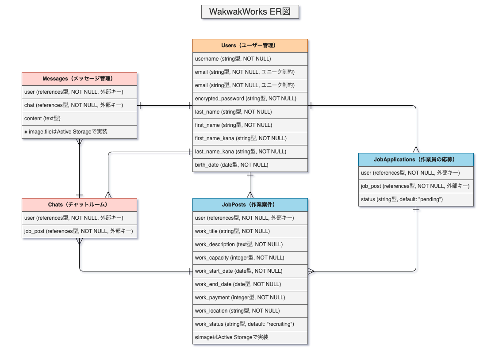
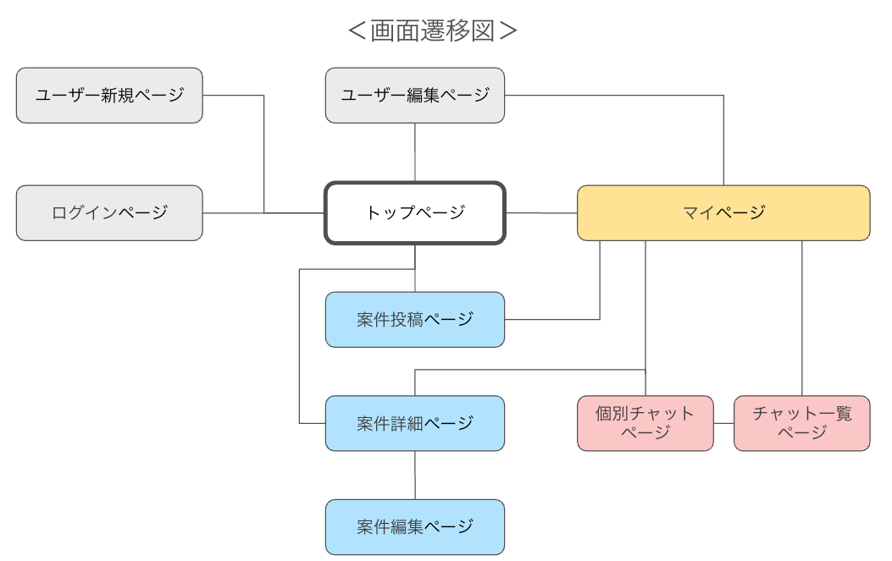

# アプリケーション名

WakwakWorks

# アプリケーション概要

施工管理者と作業員をマッチングするアプリです。

施工管理者は、案件を投稿し、作業内容・募集人数・報酬・作業日程を設定できます。

作業員は案件を閲覧し、チャットを通じて応募。施工管理者が承認するとマッチングが成立します。

リアルタイムのチャット機能も搭載し、スムーズなやり取りが可能。短期・単発の仕事探しにも最適な、

建設業界向けのマッチングサービスです。

# URL

https://wakwak-works.onrender.com/

# テスト用アカウント

テストユーザー

- ID : saitou@saitou
- Pass : 1q1q1q

Basic 認証

- ID : @admin
- Pass : @123qwe

# 利用方法

[アプリ利用ガイド](https://drive.google.com/file/d/10dBM7xrAM3ihrqRyN6R-2pp_HEVTMC8u/view?usp=drive_link)

👉 **施工管理者の場合**

1️⃣ 案件の投稿までの流れ

- ログインまたはユーザー新規登録を行う
- 「案件を投稿する」ボタンから作業案件を登録
- 案件投稿は**トップページ**または**マイページ**から可能
- マイページへは、ユーザー名をクリックすると表示されるドロップダウンリストからアクセスできる

2️⃣ 応募の承認までの流れ

- 投稿した案件に作業員が応募すると、マイページの「応募者一覧」に通知が出る
- 「○ 件の応募」表示と、「見る」ボタンが出現
- 「見る」ボタンをクリックすると、応募した作業員の一覧を表示
- ユーザー名（作業員）をクリックすると、作業員の詳細ページで情報を確認可能
- 作業員を承認する場合、「応募の状態」を「未承認」→「承認」に変更

3️⃣ チャット開始までの流れ

- 作業員を「承認」すると、「チャットルーム」に「チャットを作成」が出現
- 「チャットを作成」ボタンをクリックすると、チャットページに遷移
- メッセージの送信、作業に必要な資料や画像の共有が可能
- 施工管理者と作業員が合意すれば契約成立

（現時点ではアプリ上で契約成立を判断できないため、今後実装予定）

👉 **電気工事士（作業員）の場合**

1️⃣ 応募までの流れ

- ログインまたはユーザー新規登録を行う
- トップページから、作業案件の一覧を閲覧できる
- エリア、作業内容、日程で案件を絞り込み検索が可能
- 応募したい案件を見つけたら、詳細ページを開く
- 「応募する」ボタンをクリックする
- 応募後は、施工管理者が承認するのを待つ

2️⃣ チャット開始までの流れ

- 施工管理者に応募が承認されると、チャットルームが作成される
- 「チャットを開く」ボタンをクリックすると、チャットページに遷移
- メッセージの送受信や、作業に必要な資料・画像の共有が可能
- 施工管理者と詳細をすり合わせ、最終合意のもと契約成立

# アプリケーションを作成した背景

施工管理の仕事をする中で、作業員が親会社から適正な賃金を受け取れていない現状を感じました。

また施工管理者としても、土地勘がない地域では作業員の確保が難しく、馴染みの作業員を遠方から呼ぶことでコストが高くなる課題がありました。

そこで「WakwakWorks」は、作業員が適正な賃金で働ける仕組みを作り、施工管理者が地域の作業員を効率よく確保できる環境を整えます。さらに、作業員の評価やスキルを可視化することで、安心して雇用できる仕組みを提供し、業界の課題解決を目指しています。

# 実装した機能についての画像や GIF およびその説明

[アプリ利用ガイド](https://drive.google.com/file/d/10dBM7xrAM3ihrqRyN6R-2pp_HEVTMC8u/view?usp=drive_link)

👉 **チャット画面（リアルタイム通信）**

# 実装予定の機能

- PC やスマホへの通知機能
- 案件ごとのグループチャット機能（複数作業員と同時にやり取り可能にする）
- 互いのレビュー評価機能（⭐️1〜5 評価＋コメント）
- 現在地から作業現場までの距離表示（Google Maps API）
- 作業完了後に「作業完了」ボタンを押す機能
- 施工管理者が作業の進捗状況を管理できる機能
- スケジュールカレンダーの導入（案件の一覧管理）
- プロフィール拡充（保有資格・経験・得意分野の可視化・細分化）
- 施工管理者と作業員の契約成立後のステータス管理（着手・進行中・完了など）
- 報酬の支払い管理（仮払い・支払い完了の表示）

# データベース設計

# 画面遷移図

# 開発環境

👉 **使用言語・フレームワーク**

- バックエンド: Ruby 3.2 / Ruby on Rails 7.1
- フロントエンド: HTML5 / CSS3 / JavaScript (ES6)
- CSS フレームワーク: Bootstrap 5
- データベース: 開発環境（MySQL）、デプロイ環境（PostgreSQL）
- テンプレートエンジン: ERB (Embedded Ruby)
- リアルタイム機能: ActionCable
- 地図機能: Google Maps API (位置情報の表示・バリデーションに使用)

  👉 **使用サービス**

- バージョン管理: Git / GitHub
- デプロイ先: Render
- 画像・ファイル管理: ActiveStorage (Amazon S3)
- 認証: Devise
- 検索機能: Ransack

# 工夫したポイント

- **Bootstrap**を利用し、統一感のあるデザインを実現
- **動画背景**を採用し、動きのあるデザインを演出
- **作業案件の検索機能**を追加し、ユーザーが案件を探しやすく工夫
- **ActionCable**を活用し、リアルタイム通信のチャット機能を実装
- **複数画像の送信・ファイル送信**に対応し、円滑な情報共有を可能にした
- **作業員**と**施工管理者の役割切り替え**を実装し、１つのアカウントで両方の機能を利用可能
- **地図機能**Google Maps API (位置情報の表示・バリデーションに使用)を実装

# 改善点

- 期限が過ぎた案件を自動で”締め切り”にする
- 文字数制限やエラーメッセージなどの調整
- JavaScript のエラーメッセージの解消
- リロードなしに検索機能を使用できるようにする
- リロードしないとJavaScriptの動作が安定しない

# 制作時間

約３週間
